# Architecture API Blog avec Authentification JWT
## Module 08 - Exercise 01 Solution

---

## 🏗️ Vue d'ensemble de l'architecture en couches

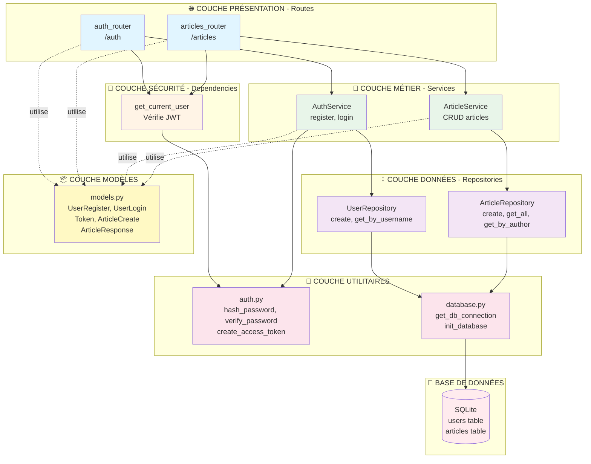

---

## 🔄 Flux d'authentification détaillé

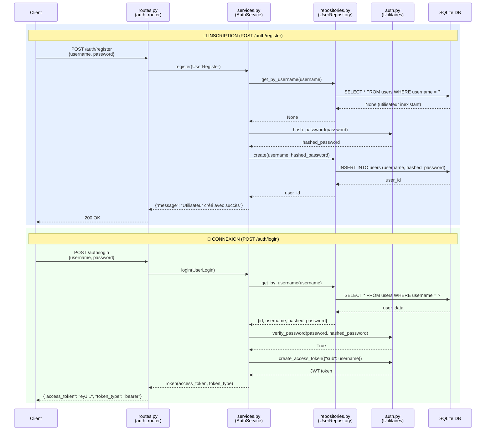

---

## 📝 Flux de gestion des articles

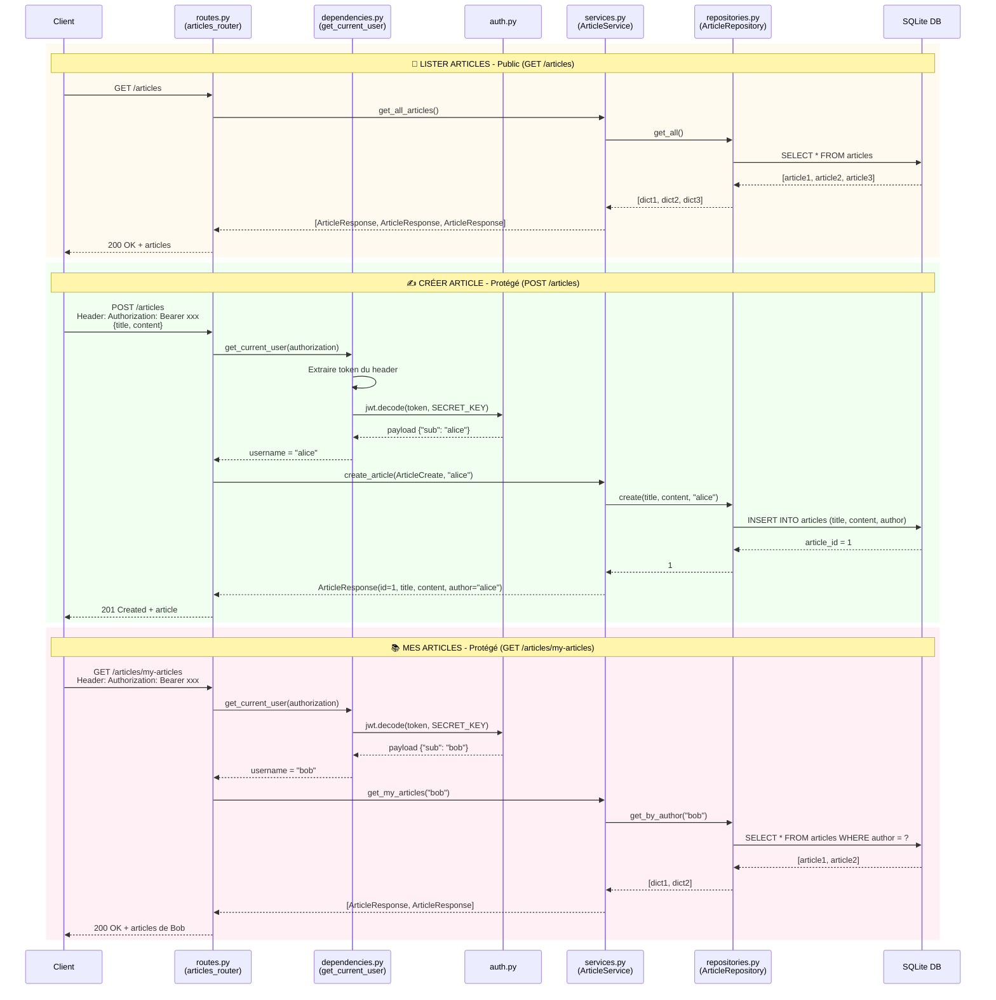

---

## 🛡️ Architecture de sécurité - Vérification JWT

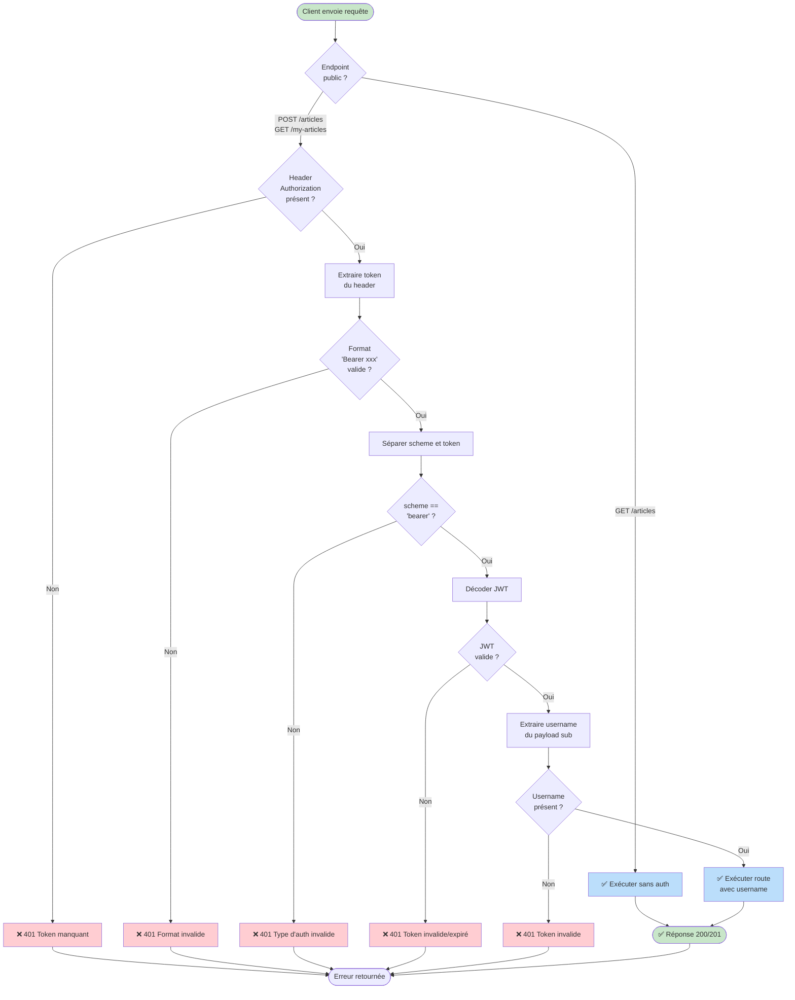

---

## 📊 Relations entre classes et méthodes

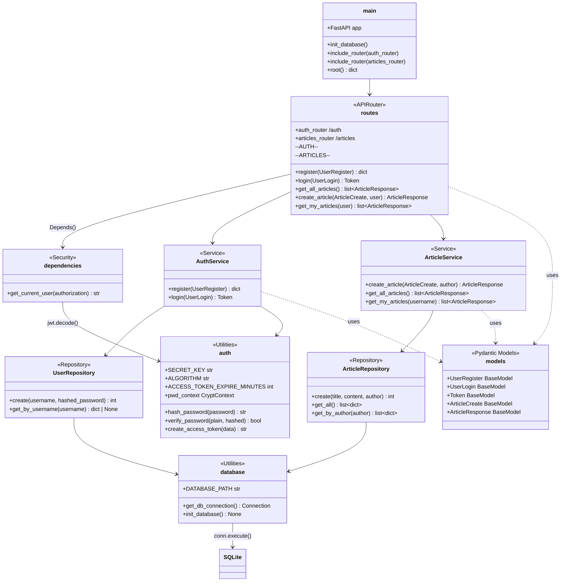

---

## 🎯 Matrice des responsabilités

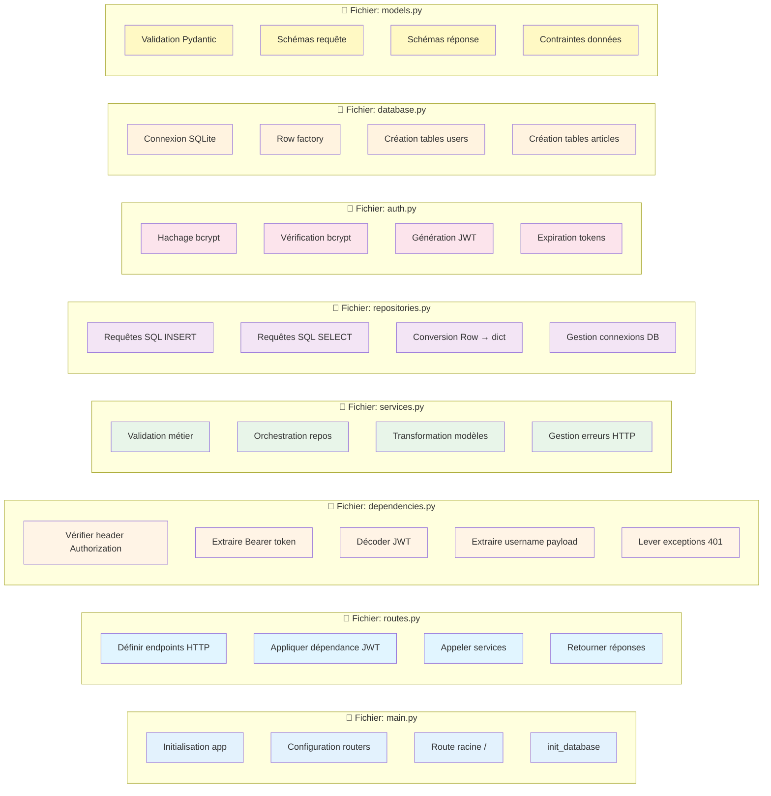

---

## 🔐 Flux complet : Créer un article (authentifié)

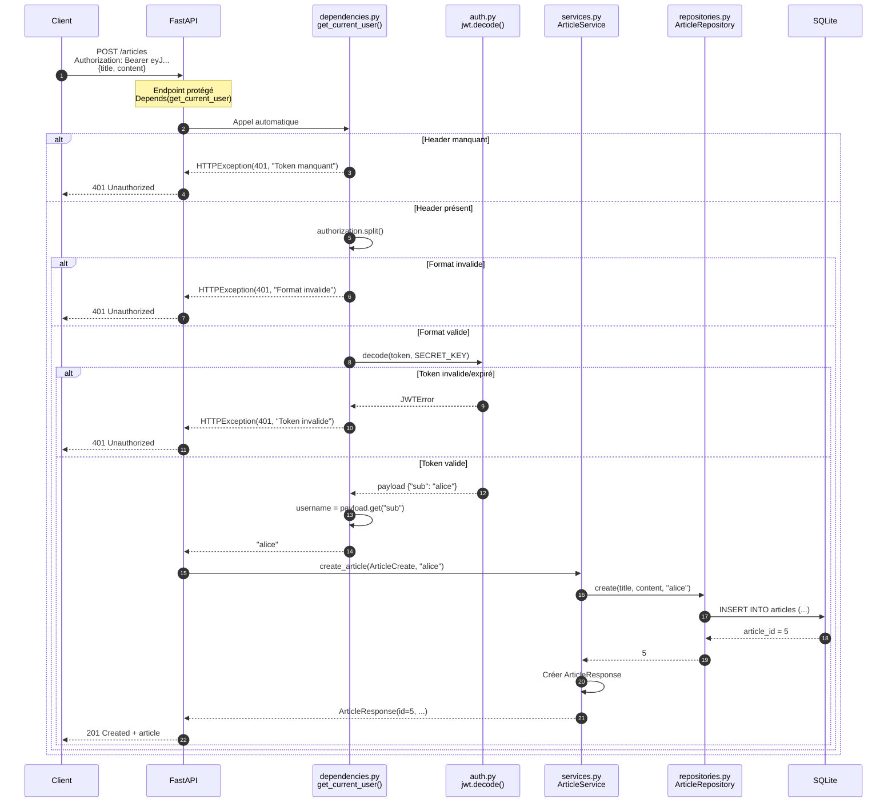

---

## 📋 Tableau récapitulatif des endpoints

| Endpoint | Méthode | Authentification | Service | Repository | Description |
|----------|---------|------------------|---------|------------|-------------|
| `/` | GET | ❌ Non | - | - | Documentation API |
| `/auth/register` | POST | ❌ Non | `AuthService.register()` | `UserRepository.create()` | Créer un compte |
| `/auth/login` | POST | ❌ Non | `AuthService.login()` | `UserRepository.get_by_username()` | Obtenir un token JWT |
| `/articles` | GET | ❌ Non | `ArticleService.get_all_articles()` | `ArticleRepository.get_all()` | Lister tous les articles |
| `/articles` | POST | ✅ JWT | `ArticleService.create_article()` | `ArticleRepository.create()` | Créer un article |
| `/articles/my-articles` | GET | ✅ JWT | `ArticleService.get_my_articles()` | `ArticleRepository.get_by_author()` | Mes articles |

---

## 📝 Structure de la base de données

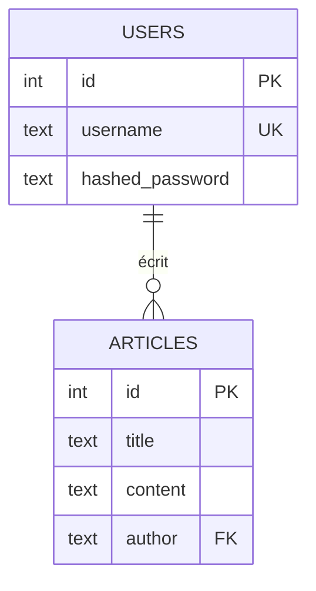

---

## 🛠️ Flux de hachage et vérification des mots de passe

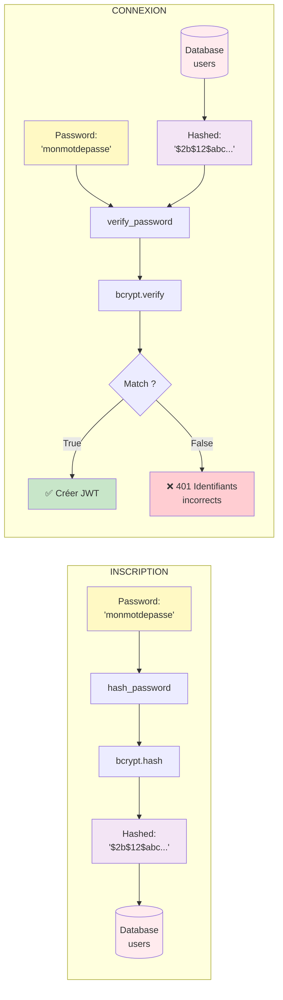

---

## 🎯 Points d'apprentissage clés

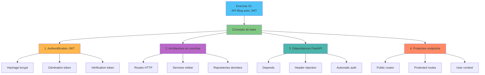

---

## 🔐 Anatomie d'un JWT Token

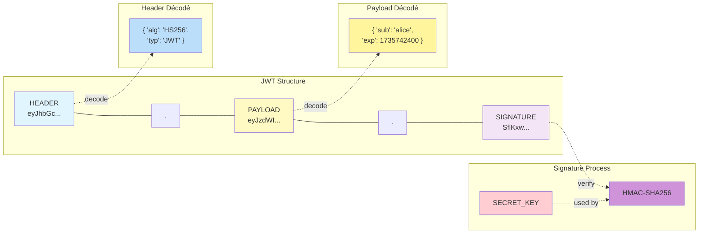

---

## 📚 Ressources et bonnes pratiques

### ✅ Bonnes pratiques implémentées

1. **Sécurité**
   - Hachage bcrypt pour les mots de passe
   - JWT avec expiration (30 minutes)
   - SECRET_KEY à changer en production
   - Validation des headers Authorization

2. **Architecture**
   - Séparation claire des couches
   - @staticmethod pour services/repos stateless
   - Modèles Pydantic pour validation
   - Gestion d'erreurs centralisée

3. **Code propre**
   - Type hints partout
   - Docstrings sur fonctions importantes
   - Nommage explicite
   - Pas de code dupliqué

### ⚠️ Améliorations possibles (Exercise 02)

1. Ajouter des rôles utilisateur (admin, user)
2. Implémenter une dépendance require_admin
3. Ajouter refresh tokens
4. Logger les tentatives de connexion
5. Rate limiting sur les endpoints sensibles

---

## 🎯 Conclusion

**Exercise 01** est une introduction complète à :
- L'authentification JWT avec FastAPI
- L'architecture en couches professionnelle
- La protection d'endpoints via dépendances
- La gestion sécurisée des mots de passe

**Prérequis pour Exercise 02** : Maîtriser ces concepts avant d'ajouter les rôles et permissions ! 🚀

---

**Créé pour le Workshop FastAPI - Module 08 Authentication**  
*Exercice 01 : Fondations de l'authentification JWT* 🔐
