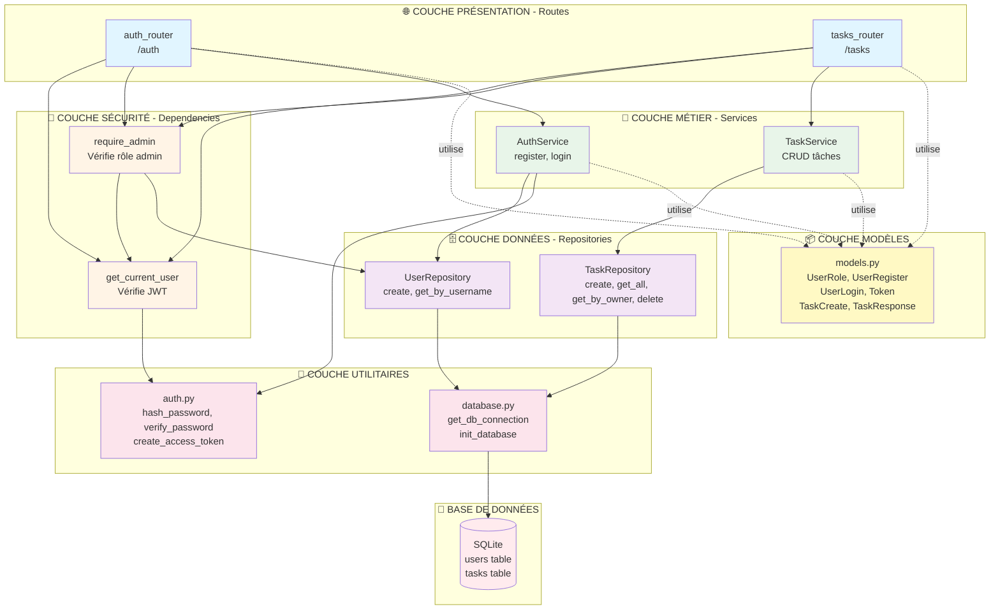
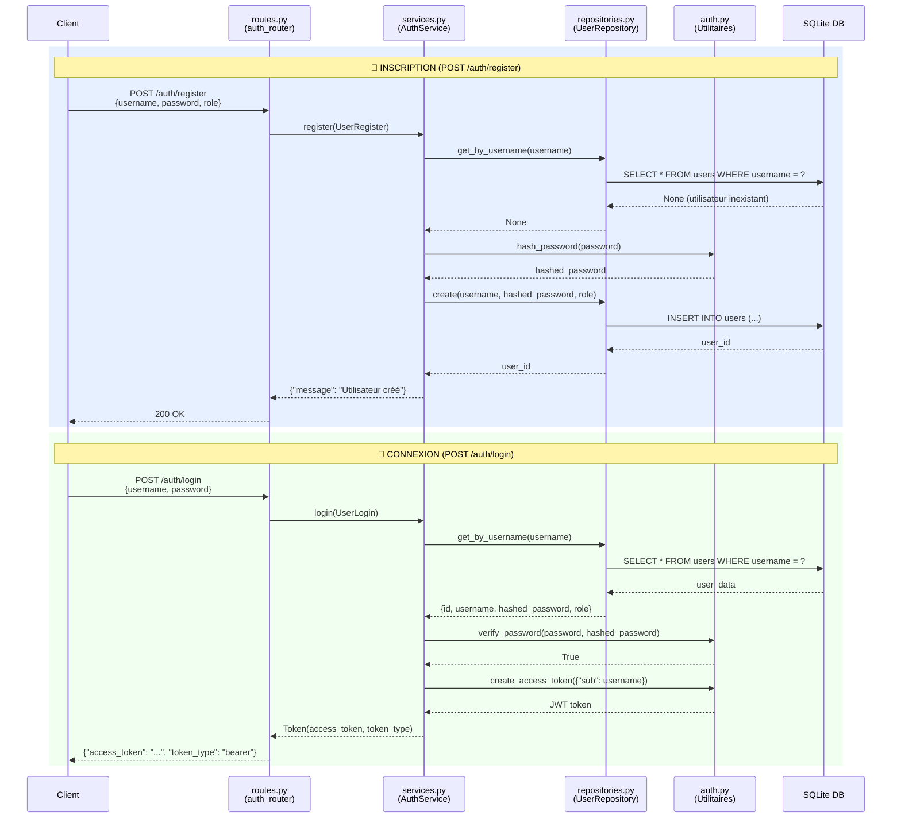
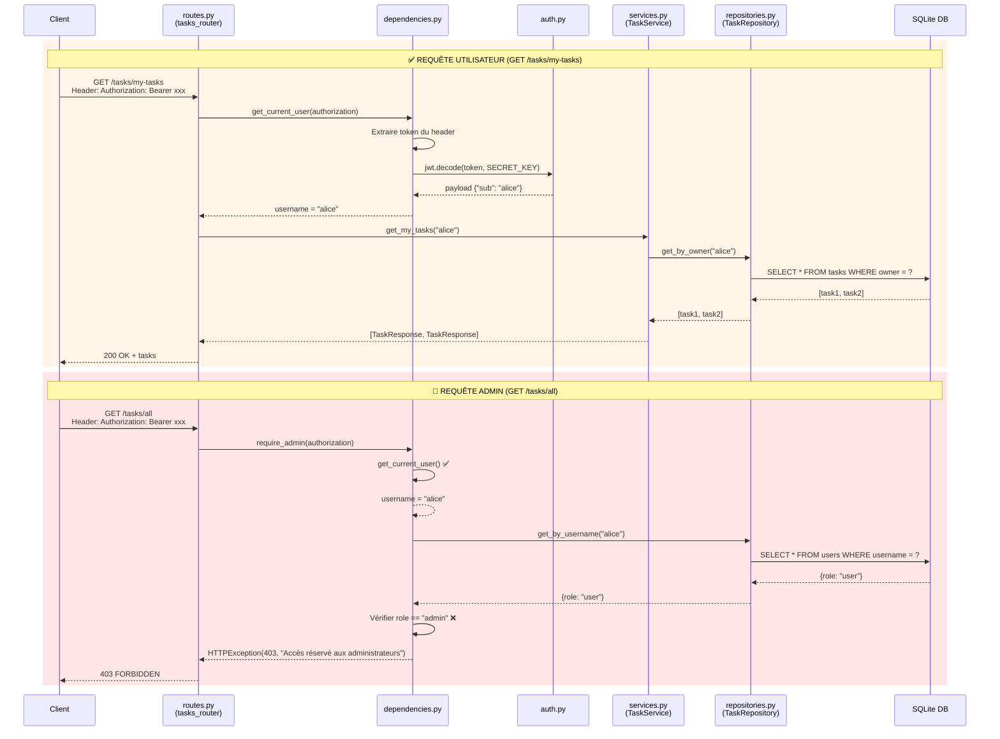
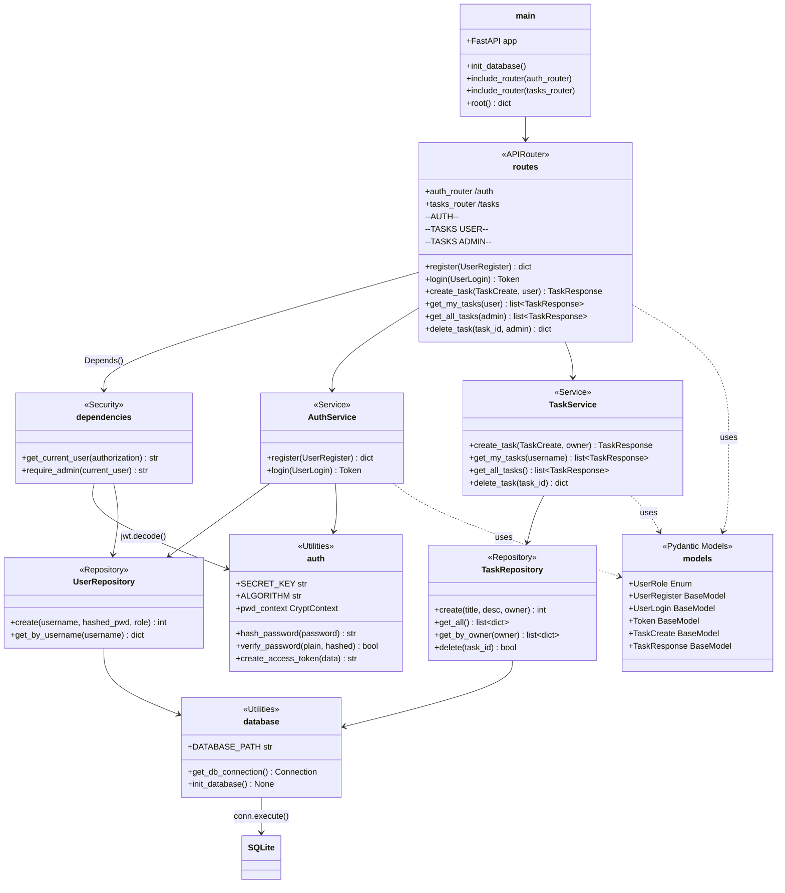
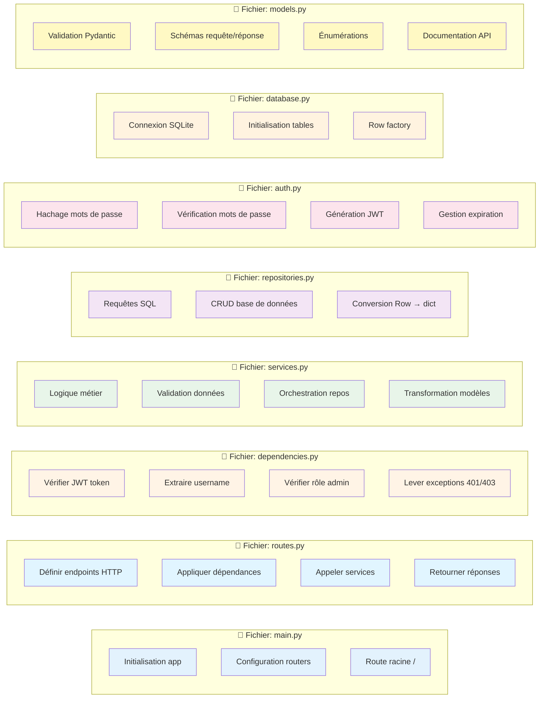
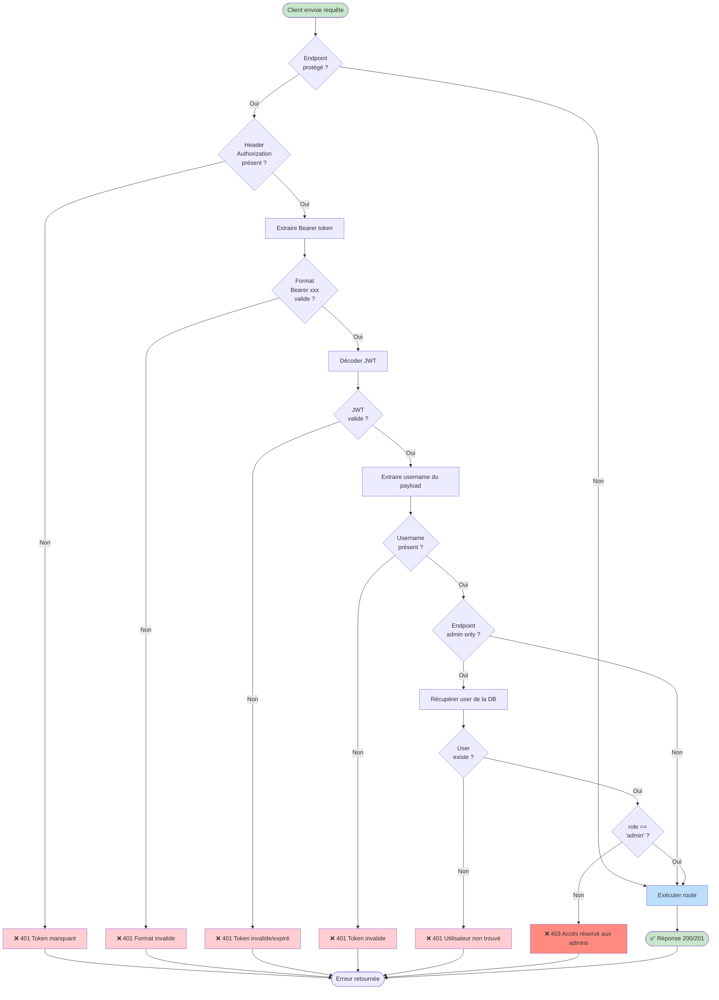
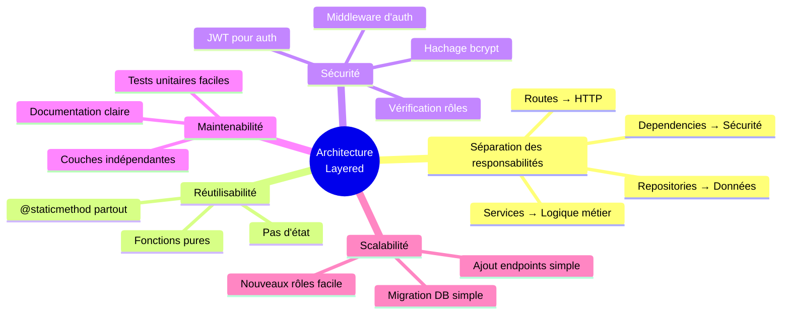

# Architecture API avec Authentification JWT
## Module 08 - Exercise 02

---

## 🏗️ Vue d'ensemble de l'architecture en couches

---

## 🔄 Flux d'authentification détaillé

---

## 🛡️ Flux d'autorisation avec JWT

---

## 📊 Relations entre classes et méthodes

---

## 🎯 Matrice des responsabilités

---

## 🔐 Architecture de sécurité - Flux complet

---

## 📋 Tableau récapitulatif des endpoints

| Endpoint | Méthode | Authentification | Autorisation | Service | Repository |
|----------|---------|------------------|--------------|---------|------------|
| `/` | GET | ❌ Non | - | - | - |
| `/auth/register` | POST | ❌ Non | - | `AuthService.register()` | `UserRepository.create()` |
| `/auth/login` | POST | ❌ Non | - | `AuthService.login()` | `UserRepository.get_by_username()` |
| `/tasks` | POST | ✅ JWT | User/Admin | `TaskService.create_task()` | `TaskRepository.create()` |
| `/tasks/my-tasks` | GET | ✅ JWT | User/Admin | `TaskService.get_my_tasks()` | `TaskRepository.get_by_owner()` |
| `/tasks/all` | GET | ✅ JWT | **Admin only** | `TaskService.get_all_tasks()` | `TaskRepository.get_all()` |
| `/tasks/{id}` | DELETE | ✅ JWT | **Admin only** | `TaskService.delete_task()` | `TaskRepository.delete()` |

---

## 🎓 Principes architecturaux appliqués

---

## 🔑 Légende des symboles

| Symbole | Signification |
|---------|---------------|
| 🌐 | Couche Présentation (Routes) |
| 🔐 | Couche Sécurité (Dependencies) |
| 💼 | Couche Métier (Services) |
| 🗄️ | Couche Données (Repositories) |
| 🔧 | Utilitaires (Auth, Database) |
| 📦 | Modèles Pydantic |
| 💾 | Base de données SQLite |
| ✅ | Succès / Autorisé |
| ❌ | Erreur / Refusé |
| 🔒 | Endpoint protégé |
| 👤 | Utilisateur normal |
| 👑 | Administrateur |

---

## 📝 Notes importantes

1. **Dépendances FastAPI** : `Depends(get_current_user)` injecte automatiquement le username
2. **Chaînage de dépendances** : `require_admin` appelle `get_current_user` en interne
3. **Stateless** : Aucun état stocké entre les requêtes, JWT contient toutes les infos
4. **Modularité** : Chaque couche peut être testée indépendamment
5. **Extensibilité** : Ajouter un nouveau rôle = modifier `UserRole` enum + ajouter une dependency

---

**Créé pour le Workshop FastAPI - Module 08 Authentication**  
*Architecture professionnelle avec JWT, rôles et permissions* 🚀
