# Architecture API Gestion de Personnages - Mini-Projet Final
## Module 10 - Applied Project (Solution Complète)

---

## 🏗️ Vue d'ensemble de l'architecture complète (3 niveaux)

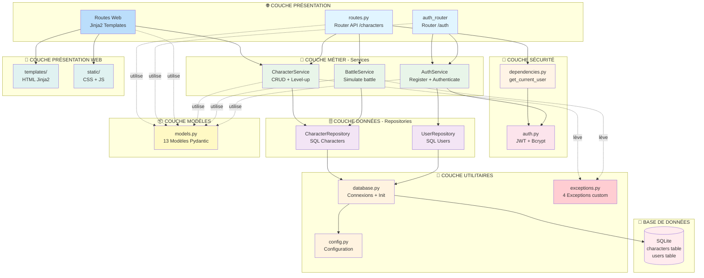

---

## 📊 Architecture en 3 niveaux de complexité

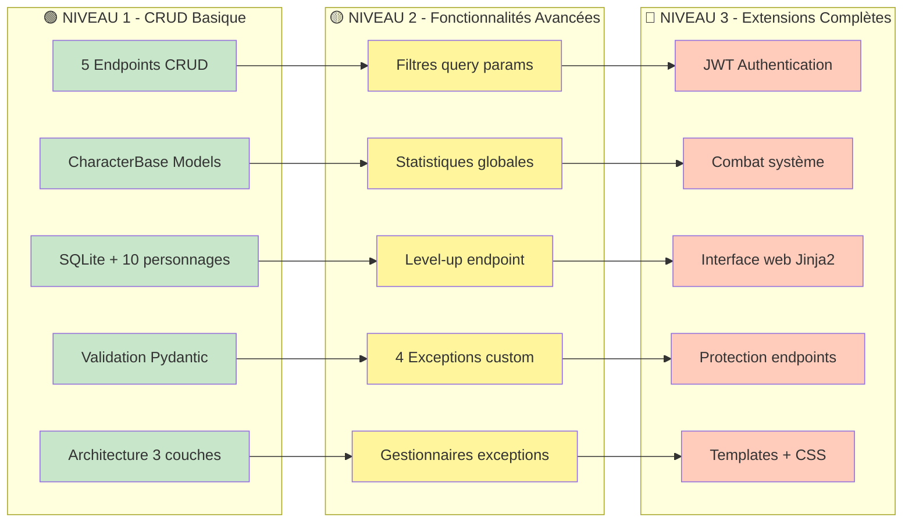

---

## 🔄 Flux CRUD complet (Niveau 1)

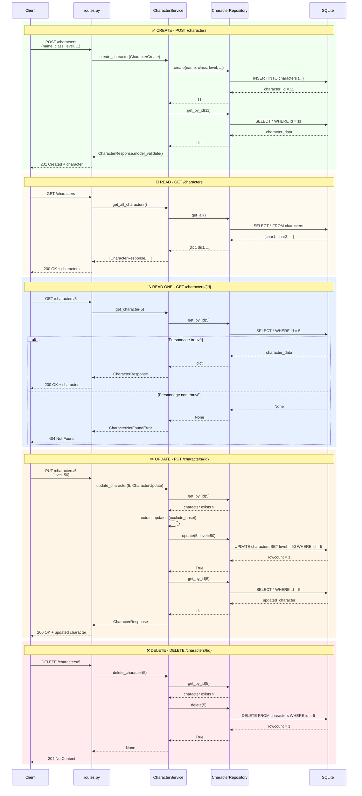

---

## 🔍 Flux de filtrage avancé (Niveau 2)

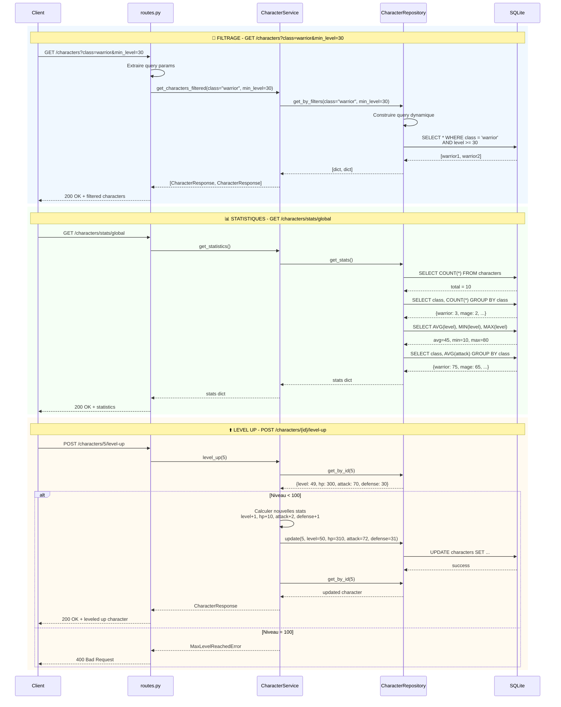

---

## 🛡️ Flux d'authentification JWT (Niveau 3)

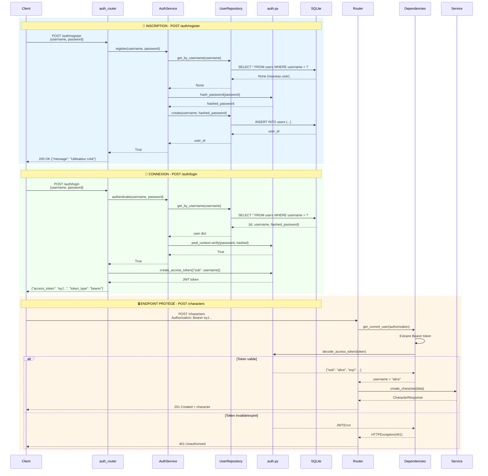

---

## ⚔️ Système de combat (Niveau 3)

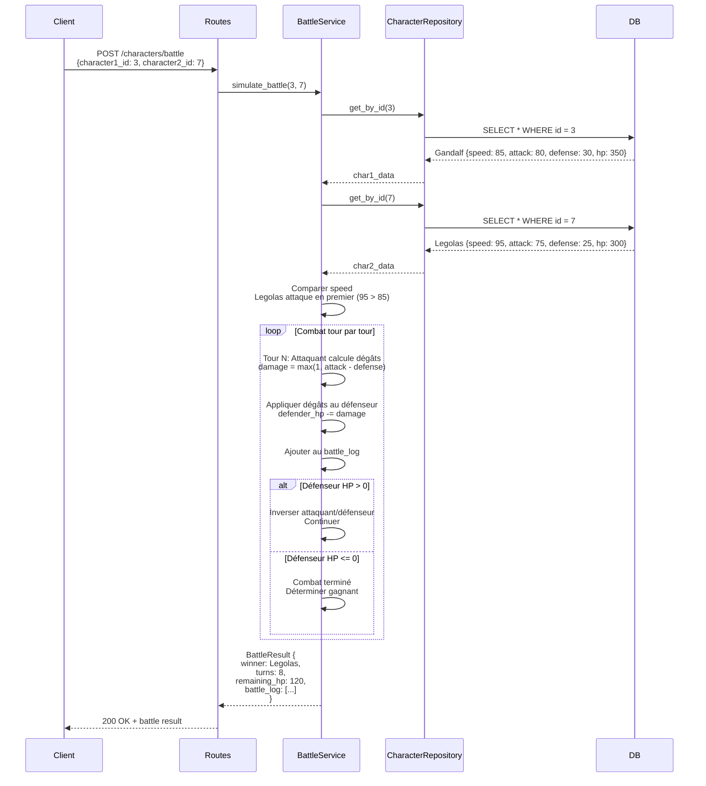

---

## 📊 Relations entre classes et méthodes

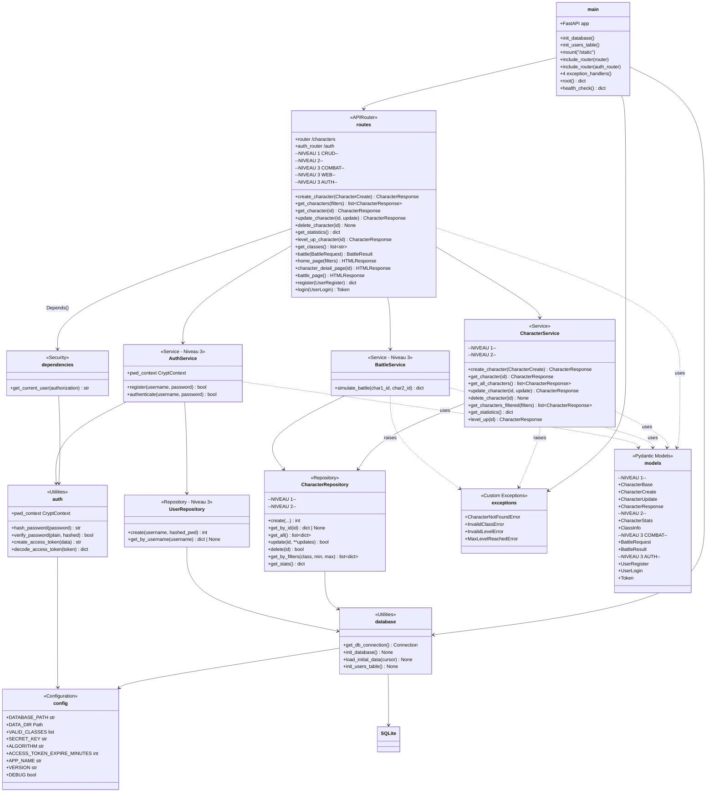

---

## 🎯 Matrice des responsabilités détaillée

```mermaid
graph TB
    subgraph "📄 main.py"
        MA1[Init FastAPI app]
        MA2[Init database]
        MA3[Mount static files]
        MA4[Include routers]
        MA5[4 Exception handlers]
        MA6[Root + Health endpoints]
    end
    
    subgraph "📄 config.py"
        CO1[DATABASE_PATH]
        CO2[VALID_CLASSES]
        CO3[JWT SECRET_KEY]
        CO4[APP_NAME + VERSION]
    end
    
    subgraph "📄 routes.py"
        RO1[15 Endpoints API]
        RO2[3 Endpoints Web HTML]
        RO3[2 Endpoints Auth]
        RO4[Query parameters]
        RO5[Depends injection]
    end
    
    subgraph "📄 dependencies.py"
        DE1[get_current_user]
        DE2[Extract Bearer token]
        DE3[Decode JWT]
        DE4[Return username]
        DE5[Raise 401 errors]
    end
    
    subgraph "📄 auth.py"
        AU1[pwd_context bcrypt]
        AU2[hash_password]
        AU3[verify_password]
        AU4[create_access_token JWT]
        AU5[decode_access_token]
    end
    
    subgraph "📄 services.py"
        SE1[CharacterService<br/>8 méthodes]
        SE2[BattleService<br/>simulate_battle]
        SE3[AuthService<br/>register + authenticate]
        SE4[Logique métier]
        SE5[Validation business]
        SE6[Lever exceptions]
    end
    
    subgraph "📄 repositories.py"
        RE1[CharacterRepository<br/>7 méthodes SQL]
        RE2[UserRepository<br/>2 méthodes SQL]
        RE3[Requêtes INSERT]
        RE4[Requêtes SELECT]
        RE5[Requêtes UPDATE]
        RE6[Requêtes DELETE]
        RE7[Agrégations stats]
    end
    
    subgraph "📄 database.py"
        DA1[get_db_connection]
        DA2[init_database]
        DA3[load_initial_data JSON]
        DA4[init_users_table]
        DA5[CREATE TABLE characters]
        DA6[CREATE TABLE users]
    end
    
    subgraph "📄 exceptions.py"
        EX1[CharacterNotFoundError]
        EX2[InvalidClassError]
        EX3[InvalidLevelError]
        EX4[MaxLevelReachedError]
    end
    
    subgraph "📄 models.py"
        MO1[CharacterBase]
        MO2[CharacterCreate + validators]
        MO3[CharacterUpdate]
        MO4[CharacterResponse]
        MO5[CharacterStats]
        MO6[BattleRequest + Result]
        MO7[UserRegister + Login]
        MO8[Token]
    end
    
    style MA1 fill:#e3f2fd
    style MA2 fill:#e3f2fd
    style MA3 fill:#e3f2fd
    style MA4 fill:#e3f2fd
    style MA5 fill:#e3f2fd
    style MA6 fill:#e3f2fd
    
    style CO1 fill:#fff3e0
    style CO2 fill:#fff3e0
    style CO3 fill:#fff3e0
    style CO4 fill:#fff3e0
    
    style RO1 fill:#e1f5ff
    style RO2 fill:#e1f5ff
    style RO3 fill:#e1f5ff
    style RO4 fill:#e1f5ff
    style RO5 fill:#e1f5ff
    
    style DE1 fill:#fff4e6
    style DE2 fill:#fff4e6
    style DE3 fill:#fff4e6
    style DE4 fill:#fff4e6
    style DE5 fill:#fff4e6
    
    style AU1 fill:#fce4ec
    style AU2 fill:#fce4ec
    style AU3 fill:#fce4ec
    style AU4 fill:#fce4ec
    style AU5 fill:#fce4ec
    
    style SE1 fill:#e8f5e9
    style SE2 fill:#e8f5e9
    style SE3 fill:#e8f5e9
    style SE4 fill:#e8f5e9
    style SE5 fill:#e8f5e9
    style SE6 fill:#e8f5e9
    
    style RE1 fill:#f3e5f5
    style RE2 fill:#f3e5f5
    style RE3 fill:#f3e5f5
    style RE4 fill:#f3e5f5
    style RE5 fill:#f3e5f5
    style RE6 fill:#f3e5f5
    style RE7 fill:#f3e5f5
    
    style DA1 fill:#fff9c4
    style DA2 fill:#fff9c4
    style DA3 fill:#fff9c4
    style DA4 fill:#fff9c4
    style DA5 fill:#fff9c4
    style DA6 fill:#fff9c4
    
    style EX1 fill:#ffccbc
    style EX2 fill:#ffccbc
    style EX3 fill:#ffccbc
    style EX4 fill:#ffccbc
    
    style MO1 fill:#c5e1a5
    style MO2 fill:#c5e1a5
    style MO3 fill:#c5e1a5
    style MO4 fill:#c5e1a5
    style MO5 fill:#c5e1a5
    style MO6 fill:#c5e1a5
    style MO7 fill:#c5e1a5
    style MO8 fill:#c5e1a5
```

---

## 🗺️ Cartographie des endpoints (20 endpoints)

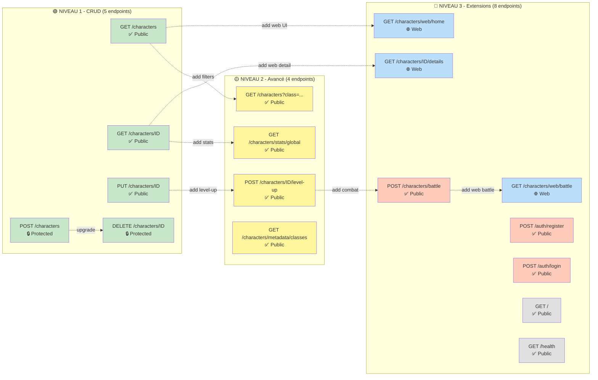

---

## 🔄 Gestion des exceptions (Niveau 2)

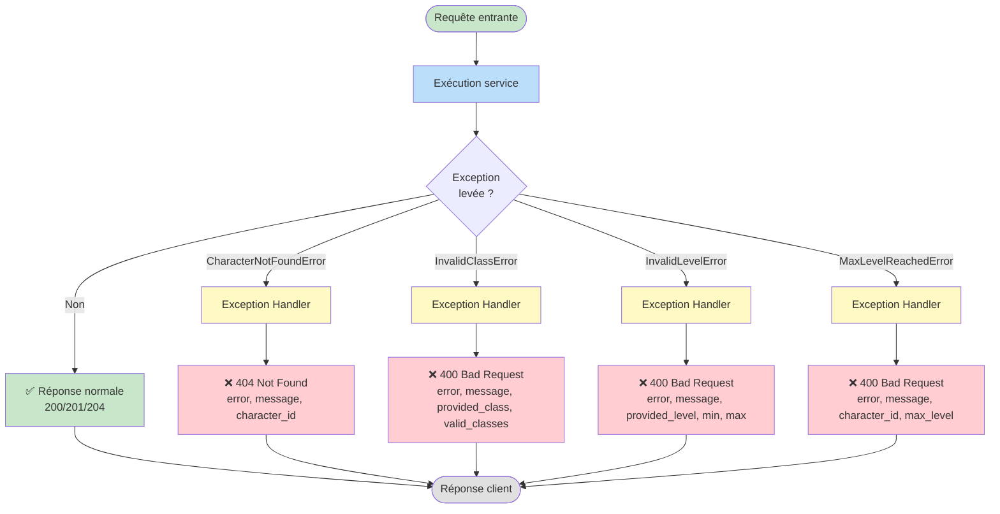

---

## 📋 Tableau récapitulatif complet

| Endpoint | Méthode | Auth | Niveau | Service | Repository | Description |
|----------|---------|------|--------|---------|------------|-------------|
| `/` | GET | ❌ | 1 | - | - | Documentation API |
| `/health` | GET | ❌ | 3 | - | - | Health check |
| `/characters` | POST | ✅ JWT | 1 | `CharacterService.create_character()` | `CharacterRepository.create()` | Créer personnage |
| `/characters` | GET | ❌ | 1 | `CharacterService.get_all_characters()` | `CharacterRepository.get_all()` | Lister tous |
| `/characters?filters` | GET | ❌ | 2 | `CharacterService.get_characters_filtered()` | `CharacterRepository.get_by_filters()` | Filtrer par classe/niveau |
| `/characters/{id}` | GET | ❌ | 1 | `CharacterService.get_character()` | `CharacterRepository.get_by_id()` | Obtenir un personnage |
| `/characters/{id}` | PUT | ❌ | 1 | `CharacterService.update_character()` | `CharacterRepository.update()` | Modifier personnage |
| `/characters/{id}` | DELETE | ✅ JWT | 1 | `CharacterService.delete_character()` | `CharacterRepository.delete()` | Supprimer personnage |
| `/characters/stats/global` | GET | ❌ | 2 | `CharacterService.get_statistics()` | `CharacterRepository.get_stats()` | Statistiques globales |
| `/characters/{id}/level-up` | POST | ❌ | 2 | `CharacterService.level_up()` | `CharacterRepository.update()` | Augmenter niveau |
| `/characters/metadata/classes` | GET | ❌ | 2 | - | - | Liste classes valides |
| `/characters/battle` | POST | ❌ | 3 | `BattleService.simulate_battle()` | `CharacterRepository.get_by_id()` | Combat entre 2 personnages |
| `/characters/web/home` | GET | ❌ | 3 | `CharacterService.*` | - | Page web liste |
| `/characters/{id}/details` | GET | ❌ | 3 | `CharacterService.get_character()` | - | Page web détail |
| `/characters/web/battle` | GET | ❌ | 3 | `CharacterService.get_all_characters()` | - | Page web combat |
| `/auth/register` | POST | ❌ | 3 | `AuthService.register()` | `UserRepository.create()` | Inscription |
| `/auth/login` | POST | ❌ | 3 | `AuthService.authenticate()` | `UserRepository.get_by_username()` | Connexion JWT |

---

## 🎨 Architecture web avec Jinja2 (Niveau 3)

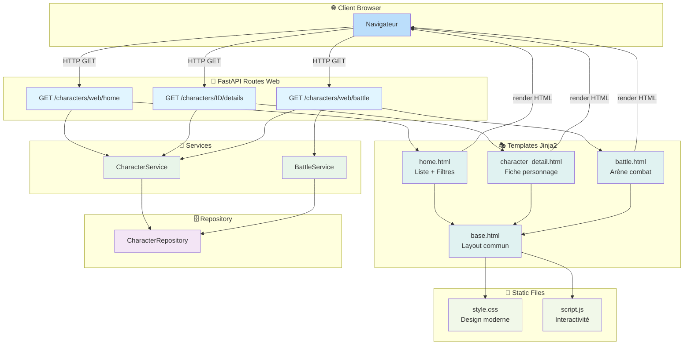

---

## 🎓 Concepts clés appliqués

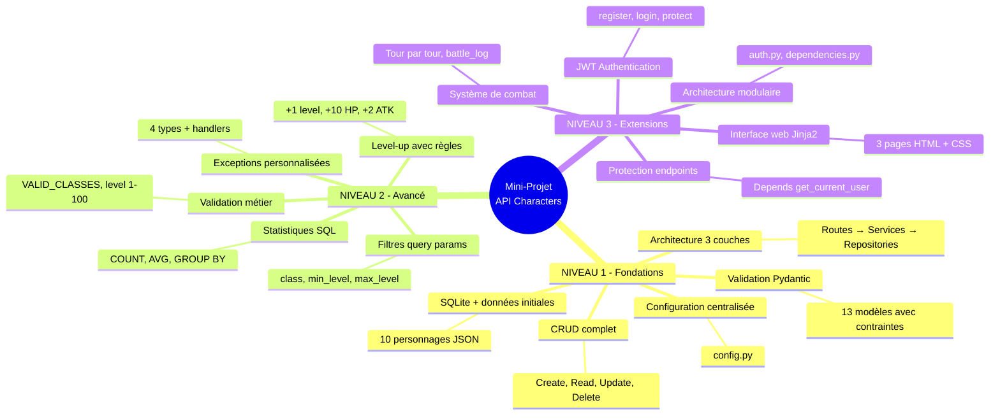

---

## 📊 Modèle de données

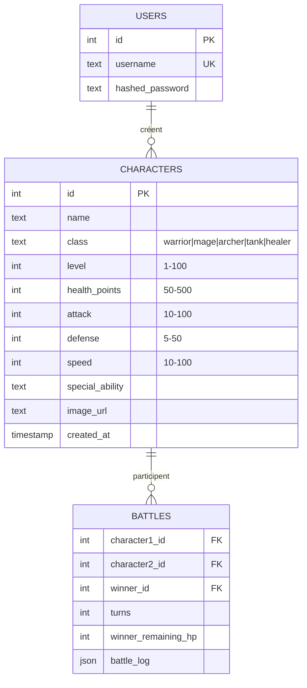

---

## 🔑 Points d'apprentissage progressifs

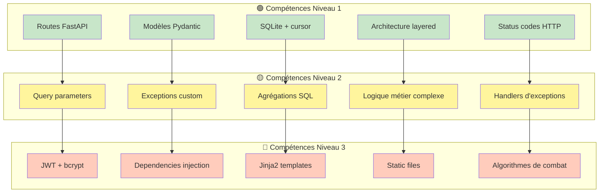

---

## 🚀 Workflow de développement recommandé

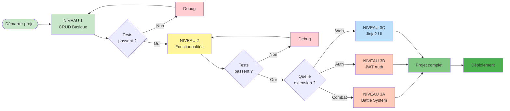

---

## 💡 Bonnes pratiques appliquées

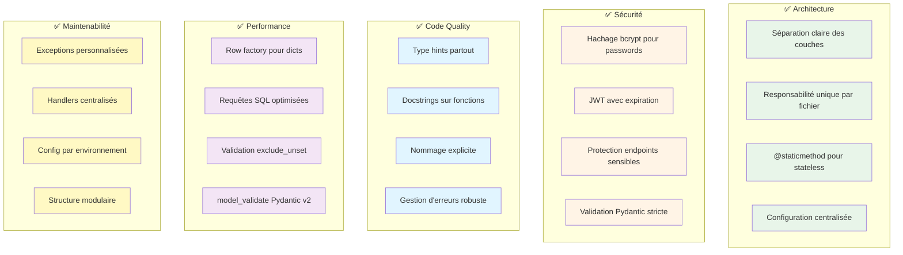

---

## 🎯 Conclusion

Ce mini-projet synthétise **tous les concepts du workshop FastAPI** :

### 📚 Modules 01-09 appliqués

- **Module 01** : Python foundations (classes, fonctions, types)
- **Module 02** : First API (routes, documentation)
- **Module 03** : Path & Query params (filtres, pagination)
- **Module 04** : Pydantic validation (13 modèles avec validateurs)
- **Module 05** : SQLite database (connexions, requêtes, transactions)
- **Module 06** : Layered architecture (Routes → Services → Repositories)
- **Module 07** : Error handling (4 exceptions + handlers)
- **Module 08** : JWT authentication (register, login, protect)
- **Module 09** : Jinja2 templates (3 pages web + CSS)

### 🎓 Compétences acquises

- ✅ **Architecture professionnelle** en couches
- ✅ **CRUD complet** avec validation
- ✅ **Gestion d'erreurs** robuste
- ✅ **Authentification JWT** sécurisée
- ✅ **Interface web** moderne
- ✅ **Logique métier complexe** (combat, level-up)
- ✅ **Tests** et validation
- ✅ **Documentation** automatique

### 🚀 Prêt pour la production

Le projet intègre les bonnes pratiques pour un déploiement réel :
- Configuration par environnement
- Gestion d'erreurs complète
- Sécurité (JWT, bcrypt)
- Documentation Swagger
- Health check endpoint
- Structure modulaire évolutive

---

**Créé pour le Workshop FastAPI - Module 10 Applied Project**  
*Mini-projet complet synthétisant les modules 01-09* 🎓✨
