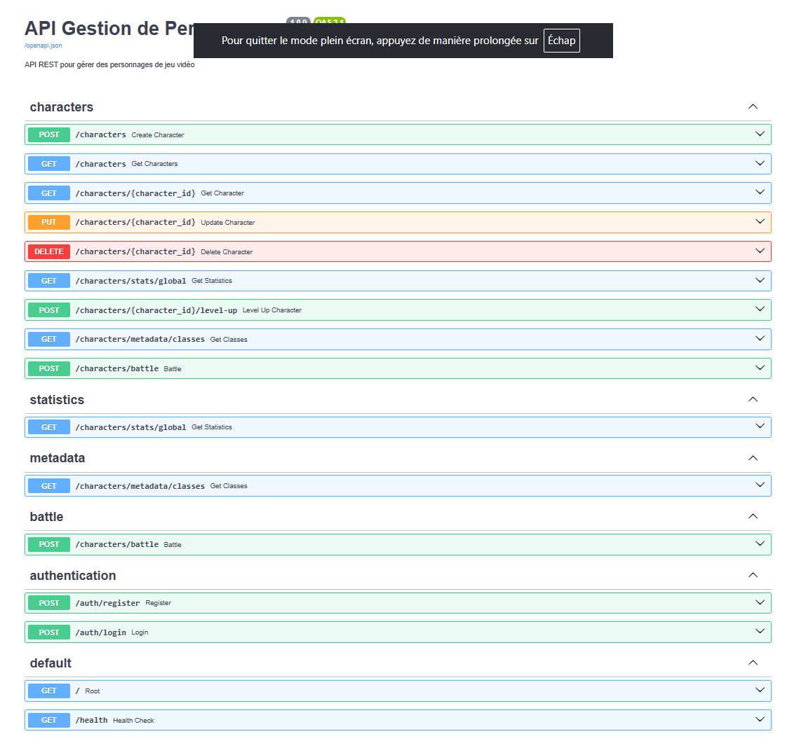
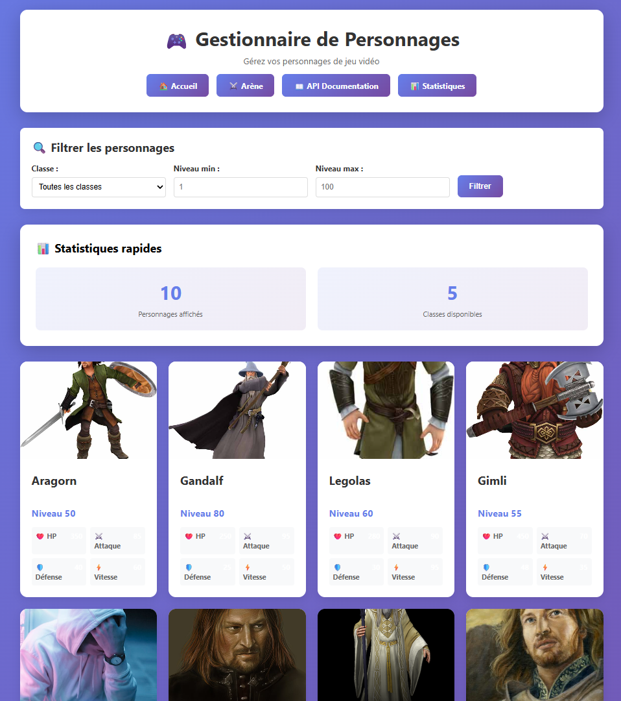
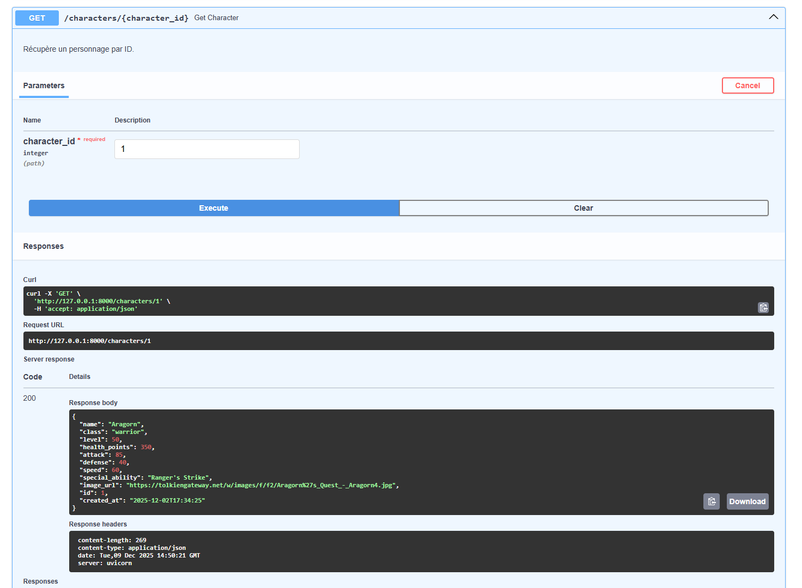

# 🚀 Workshop FastAPI - Formation Complète

[](https://www.python.org/downloads/)
[](https://fastapi.tiangolo.com/)
[](https://docs.pytest.org/)
[](https://www.docker.com/)
[](LICENSE)
[](https://github.com/psf/black)

> Workshop pratique pour maîtriser FastAPI de A à Z en 10 étapes progressives

## 📖 À propos

Ce workshop est conçu pour les **développeurs débutants à intermédiaires** souhaitant apprendre FastAPI, le framework Python moderne pour créer des APIs REST performantes. Chaque étape contient des exemples pratiques, des exercices et un projet final complet.

**Format :** 10 étapes progressives + 1 mini-projet de synthèse

## ✨ Ce que vous allez apprendre

- ✅ Créer des APIs REST modernes avec FastAPI
- ✅ Valider les données avec Pydantic
- ✅ Gérer une base de données SQLite
- ✅ Structurer une application en couches (MVC)
- ✅ Implémenter la gestion d'erreurs personnalisée
- ✅ Ajouter l'authentification JWT
- ✅ Créer des interfaces web avec Jinja2
- ✅ Écrire des tests automatisés avec pytest
- ✅ Conteneuriser avec Docker
- ✅ Développer un projet complet from scratch

## 📚 Structure du Workshop

### 🎯 Étapes Fondamentales (1-4)

| Étape | Titre | Concepts clés |
|-------|-------|---------------|
| **01** | [Fondations Python](01-python-essentials/) | Types, fonctions, classes, dictionnaires |
| **02** | [Première API FastAPI](02-fastapi-essentials/) | Routes, méthodes HTTP, Swagger, query params |
| **03** | [Path & Query Parameters](03-http-methods/) | Path params, validation, valeurs par défaut |
| **04** | [Validation avec Pydantic](04-models-and-validation/) | Modèles, contraintes, aliases, validateurs |

### 🔨 Étapes Intermédiaires (5-7)

| Étape | Titre | Concepts clés |
|-------|-------|---------------|
| **05** | [Base de données SQLite](05-data-storage/) | SQLite, CRUD, connexions, transactions |
| **06** | [Architecture en couches](06-layered-architecture/) | Models, Repositories, Services, Routes |
| **07** | [Gestion des erreurs](07-error-handling/) | Exceptions custom, status codes, handlers |

### 🚀 Étapes Avancées (8-9)

| Étape | Titre | Concepts clés |
|-------|-------|---------------|
| **08** | [Authentification JWT](08-authentication/) | Tokens, hachage, sécurité, dependencies |
| **09** | [Templates Jinja2](09-jinja2-templates/) | HTML, CSS, templating, interfaces web |

### 🎓 Projet Final (10)

| Étape | Titre | Description |
|-------|-------|-------------|
| **10** | [Mini-Projet de Synthèse](10-applied-project/) | API complète de gestion de personnages avec 3 niveaux de difficulté |

## 🎮 Mini-Projet : API de Gestion de Personnages

Le projet final consiste à développer une **API REST complète** pour gérer des personnages de jeu vidéo inspirés du Seigneur des Anneaux.

### Fonctionnalités principales

**Niveau 1 - Base** (Obligatoire)
- ✅ CRUD complet (Create, Read, Update, Delete)
- ✅ Validation Pydantic avec contraintes
- ✅ Architecture en couches
- ✅ Base SQLite avec 10 personnages pré-chargés

**Niveau 2 - Intermédiaire** (Obligatoire)
- ✅ Exceptions personnalisées
- ✅ Filtres de recherche (classe, niveau)
- ✅ Endpoint de statistiques
- ✅ Système de level-up

**Niveau 3 - Avancé** (Optionnel - au choix)
- 🔐 Authentification JWT
- 🎨 Interface web avec Jinja2
- ⚔️ Système de combat entre personnages
- 🐳 Conteneurisation Docker

### Aperçu des endpoints
```
POST   /characters              Créer un personnage
GET    /characters              Lister tous les personnages
GET    /characters/{id}         Obtenir un personnage
PUT    /characters/{id}         Modifier un personnage
DELETE /characters/{id}         Supprimer un personnage
GET    /characters/stats/global Statistiques globales
POST   /characters/{id}/level-up Monter de niveau
POST   /characters/battle       Combat entre deux personnages
```

### Screenshots

<table>
<tr>
<td width="50%">

<p align="center"><em>Documentation interactive Swagger</em></p>
</td>
<td width="50%">

<p align="center"><em>Interface web Jinja2</em></p>
</td>
</tr>
<tr>
<td width="50%">

<p align="center"><em>Arène de combat interactive</em></p>
</td>
<td width="50%">

<p align="center"><em>Fiche détaillée d'un personnage</em></p>
</td>
</tr>
</table>

## 🛠️ Prérequis

### Logiciels requis

- **Python 3.12+** ([Télécharger](https://www.python.org/downloads/))
- **Git** ([Télécharger](https://git-scm.com/))
- Un éditeur de code (VS Code recommandé)
- Un navigateur web moderne

### Connaissances recommandées

- ✅ Bases de Python (variables, fonctions, classes)
- ✅ Notions de HTTP et APIs REST
- ⚠️ Aucune expérience FastAPI requise (on part de zéro !)

## 🚀 Installation Rapide

### 1. Cloner le repository
```bash
git clone https://github.com/votre-username/fastapi-workshop.git
cd fastapi-workshop
```

### 2. Créer un environnement virtuel

**Windows :**
```bash
python -m venv venv
venv\Scripts\activate
```

**Mac/Linux :**
```bash
python3 -m venv venv
source venv/bin/activate
```

### 3. Installer les dépendances
```bash
pip install -r requirements.txt
```

### 4. Lancer une étape
```bash
# Exemple : Étape 1
cd 02-fastapi-essentials
uvicorn concepts.concepts_01_hello_world:app --reload
```

Ouvrir dans le navigateur : http://localhost:8000

## 📖 Utilisation du Workshop

### Progression recommandée

1. **Suivre les étapes dans l'ordre** (01 → 10)
2. **Lire le README.md** de chaque étape
3. **Exécuter les exemples** fournis
4. **Faire les exercices** proposés
5. **Comparer avec la solution** si besoin

### Structure d'une étape type
```
01-python-essentials/
├── README.md           # Explications et concepts
├── concepts/           # Exemples de code
│   ├── concepts_01_functions.py
│   └── concepts_02_path_parameters.py
├── exercises/          # Exercices à faire
    ├── exercise_01.py
    └── exercise_02.py
```

### Mini-Projet (Étape 10)

Le mini-projet contient **deux versions** :
```
10-applied-project/
├── README.md                    # Cahier des charges
├── CONSIGNES.md                 # Instructions détaillées
├── GUIDE_DEMARRAGE.md           # Guide pas à pas
└── mini-projet/                 # Version étudiants (squelettes)
    ├── app/
    │   ├── main.py              # TODO à compléter
    │   ├── models.py            # TODO à compléter
    │   └── ...
    └── tests/

10-applied-project-solution/
└── mini-projet/                 # Solution complète (formateur)
    ├── app/                     # Code complet
    ├── tests/                   # Tests complets
    └── CORRECTION.md            # Guide de correction
```

## 🧪 Tests

Chaque étape contient des tests automatisés.
```bash
# Installer les dépendances de test
pip install pytest pytest-cov httpx

# Lancer les tests d'une étape
cd 10-applied-project
pytest -v

# Avec couverture de code
pytest --cov=app --cov-report=html
```

## 🐳 Docker (Étape 10)

Le projet final peut être lancé avec Docker :
```bash
cd 10-applied-project

# Build de l'image
docker-compose build

# Démarrer les services
docker-compose up

# Accéder à l'application
# API: http://localhost:8000
# Docs: http://localhost:8000/docs
```

## 📊 Technologies Utilisées

| Technologie | Usage |
|-------------|-------|
| Python | Langage principal |
| FastAPI | Framework API |
| Pydantic | Validation de données |
| SQLite | Base de données |
| Uvicorn | Serveur ASGI |
| Pytest | Tests automatisés |
| Jinja2 | Templating HTML |
| Python-Jose | Gestion JWT |
| Passlib | Hachage de mots de passe |

## 📝 Ressources Complémentaires

### Documentation officielle
- [FastAPI](https://fastapi.tiangolo.com/) - Documentation complète
- [Pydantic](https://docs.pydantic.dev/) - Validation de données
- [SQLite](https://www.sqlite.org/docs.html) - Base de données

### Tutoriels recommandés
- [Real Python - FastAPI](https://realpython.com/fastapi-python-web-apis/)
- [FastAPI Best Practices](https://github.com/zhanymkanov/fastapi-best-practices)
- [Awesome FastAPI](https://github.com/mjhea0/awesome-fastapi)

## 🤝 Contribution

Les contributions sont les bienvenues ! Pour contribuer :

1. Forkez le projet
2. Créez une branche (`git checkout -b feature/amelioration`)
3. Committez vos changements (`git commit -m 'Ajout d'une fonctionnalité'`)
4. Poussez vers la branche (`git push origin feature/amelioration`)
5. Ouvrez une Pull Request

## 📄 Licence

Ce projet est sous licence MIT. Voir le fichier [LICENSE](LICENSE) pour plus de détails.

## 👨‍🏫 Auteur

**Rémi Julien** - Formateur & Consultant  
📧 Email: contact@dcid-consulting.fr  
🏢 [Dcid Consulting](https://dcid-consulting.fr)  
💼 LinkedIn: [Rémi Julien](https://linkedin.com/in/remi-julien)

## 🙏 Remerciements

- Merci à l'équipe FastAPI pour ce framework exceptionnel
- Inspiré par les meilleures pratiques de la communauté Python

---

<p align="center">
  <strong>⭐ Si ce workshop vous a aidé, n'hésitez pas à laisser une étoile !</strong><br>
  <sub>Fait avec ❤️ pour les développeurs Python</sub>
</p>

<p align="center">
  <a href="#-workshop-fastapi---formation-complète">⬆️ Retour en haut</a>
</p>